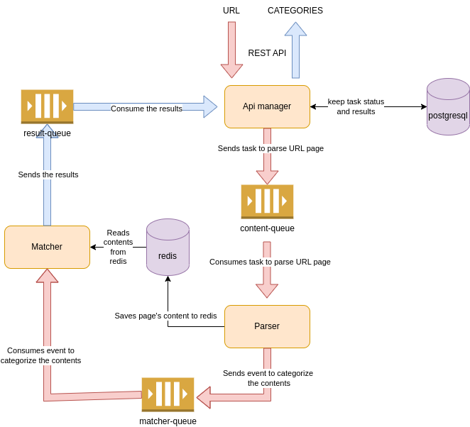

# Categorized dev tool

This is a system that categorizes web pages based on a keyword category.

A Keyword can contain either single word (one word only) or phrases up to 6 words

A Keyword Category can contain 1 to 1000 words/phrases.

If a Keyword from a category is found on the page, then the page should be categorized with thatcategory.
Match is case-insensitive.

## How to use

Clone the repository, then:
```
docker-compose up -d
```

Then open http://localhost:8082/swagger-ui/index.html and use two request:

### Create task

```
curl -X 'POST' \
  'http://localhost:8082/categorize' \
  -H 'accept: */*' \
  -H 'Content-Type: application/json' \
  -d '{
  "url": "https://kosbr.github.io"
}'
```

It returns task id, for example: 

```
{
  "id": "7c4317c0-1802-4cd8-b748-5ff30b332340"
}
```

### Check task

Use id from the previous step.
```
curl -X 'GET' \
  'http://localhost:8082/categorize/7c4317c0-1802-4cd8-b748-5ff30b332340' \
  -H 'accept: */*'
```
As soon as results are ready, it will return the result with "Ready" status:

```
{
  "id": "7c4317c0-1802-4cd8-b748-5ff30b332340",
  "url": "https://kosbr.github.io",
  "created": "2023-03-18T22:16:39.274978Z",
  "updated": "2023-03-18T22:16:40.066057Z",
  "status": "READY",
  "result": "useful knowledge"
}
```
Categories are listed in "result" field.

### Some additional links

- http://localhost:15672/ - rabbit mq (guest/guest)
- http://localhost:8081/ - redis commander

Microservices:
- https://github.com/kosbr/content-categorize-api-manager
- https://github.com/kosbr/content-categorize-page-parser
- https://github.com/kosbr/content-categorize-matcher

Docker images (built by github actions):

- https://hub.docker.com/repositories/kosbr?search=content

## Architecture

The service is implemented using microservice architecture. Following components are used:

- **Api manager** to handle REST endpoints, collect and keep results
- **Parser** to extract page's contents
- **Matcher** to find categories inside a page

and infrastructure:

- **postgresql** for keeping results
- **redis** for temporary storage of parsed content from web pages
- **rabbitmq** for messaging between microservices




- each component can be scaled
- each component can be down without loosing data